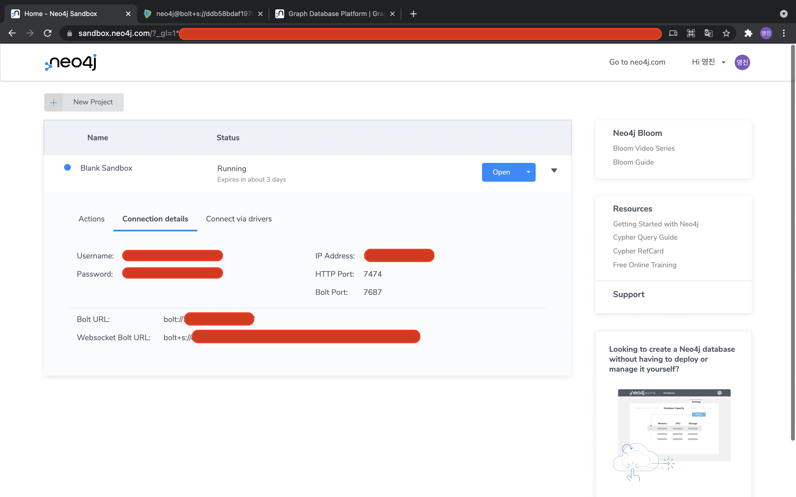

# Neo4j 사용법

- 파이썬으로 크롤링한 데이터를 가지고 Neo4j를 사용해보자.
- 이분의 포스트를 차근차근 따라했다.
    - https://mons1220.tistory.com/249?category=866625

# 환경설정

내가 공부하는데 사용한 환경은 다음과 같다. 
- google colab

이 환경을 선택한 이유는 판다스와 넘파이가 미리 설치되어 있기 때문이다. (~~내 맥북 더럽히고 싶지 않아서.~~)

하지만 google colab에는 Neo4j가 설치되어있지 않아 별개로 설치해주어야 한다. 설치 방법은 다음과 같다. 

```
!pip install neo4j
```

## Neo4j Sandbox

Neo4j는 웹 브라우저에서 무료로 프로젝트를 만들 수 있는 샌드박스를 제공한다.
 - 사이트 : https://neo4j.com/


sandbox 프로젝트를 생성하면 다음과 같이 나온다. 



여기에 나와있는 정보들을 이용하여 Neo4j를 사용하면 된다.

# Neo4j Docker 

Neo4j는 docker image를 지원한다. image 설치는 다음과 같다.
```
sudo docker pull neo4j
``` 
이미지를 설치하고 이를 실행시키려면 다음과 같이 명령어를 입력하면 된다. 
```
sudo docker run
            --name testneo4j        # docker run name
            -p 7474:7474            # 7474 for HTTP
            -p 7687:7687            # 7687 for Bolt
            -d                      # deamon start
            -v $HOME/neo4j/data:/data   # data path link
            -v $HOME/neo4j/logs:/logs   # logs path link
            -v $HOME/neo4j/import:/var/lib/neo4j/import # import path link
            -v $HOME/neo4j/plugins:/plugins             # plugins path link
            --env NEO4J_AUTH=<id>/<password>                 # id/password
            neo4j:latest 
```

# 데이터 셋팅

우리가 사용할 데이터는 2021년 2월 1일 부터 28일까지의 네이버 랭킹 뉴스이다. 우리는 키워드 추출을 하기 위해서 `konlpy` 라이브러리를 사용한다. colab에서 `konlpy`를 별개로 설치해주어야 하는데, 설치 방법은 다음과 같다.
```
# 라이브러리 설치
!apt-get update 
!apt-get install g++ openjdk-8-jdk python-dev python3-dev 
!pip3 install JPype1-py3 
!pip3 install konlpy

##############################
# konlpy 라이브러리의 코드를 조금 수정해주어야 한다. 
path : /usr/local/lib/python3.7/dist-packages/konlpy/jvm.py

    if jvmpath:
        jpype.startJVM(jvmpath, '-Djava.class.path=%s' % classpath,
                                '-Dfile.encoding=UTF8',
                                '-ea', '-Xmx{}m'.format(max_heap_size))
로 변경
```
데이터 수집 코드는 다음과 같다. 
## 크롤링
```
import requests
from bs4 import BeautifulSoup as BS
import pandas as pd
import numpy as np
import re


""" 네이버 랭킹 뉴스 긁어오기 """
headers = {'User-Agent': 'Mozilla/5.0 (Windows NT 10.0; Win64; x64) AppleWebKit/537.36 (KHTML, like Gecko) Chrome/84.0.4147.135 Safari/537.36'}
d_list = []
start_data = 20210201
end_data = 20210228
for date_int in range(start_data, end_data):
    date = str(date_int)
    url = "https://news.naver.com/main/ranking/popularDay.nhn?date=" + date
    html = requests.get(url, headers=headers).text
    soup = BS(html, 'html.parser')
    ranking_total = soup.find_all(class_='rankingnews_box')

    for item in ranking_total:
        media = item.a.strong.text
        news = item.find_all(class_="list_content")
        for new in news:
            d = {}
            d['media'] = media
            d['src'] = "https://news.naver.com/" + new.a['href']
            d['title'] = new.a.text
            d['date'] = date
            d_list.append(d)
df = pd.DataFrame(d_list)
```
|   |    media |                                               src |                                                                       title |     date |
|--:|---------:|--------------------------------------------------:|----------------------------------------------------------------------------:|---------:|
| 0 | 서울경제 | https://news.naver.com//main/ranking/read.nave... |                 [단독] 신고가에 판 아파트 한달뒤 거래취소···가격왜곡 불렀다 | 20210201 |
| 1 | 서울경제 | https://news.naver.com//main/ranking/read.nave... |                         가족이라도 사는 곳 다르면 5인 이상 모여 세배 못한다 | 20210201 |
| 2 | 서울경제 | https://news.naver.com//main/ranking/read.nave... | 조국 딸 '의사국시' 합격 논란에 정경희 "입학부정 주범···검찰, 즉각 기소해야" | 20210201 |
| 3 | 서울경제 | https://news.naver.com//main/ranking/read.nave... |                 게임스톱과 다른데···'공매도 테마' 이유로 셀트리온 이상 급등 | 20210201 |
| 4 | 서울경제 | https://news.naver.com//main/ranking/read.nave... |                            공매도 세력 버티기 돌입···게임스톱 전쟁 길어진다 | 20210201 |
## 필요없는 문자 제거
```
""" 필요 없는 문자 제거 """
def clean_text(row):
    text = row['title']
    pattern = '([a-zA-Z0-9_.+-]+@[a-zA-Z0-9-]+\.[a-zA-Z0-9-.]+)'
    text = re.sub(pattern=pattern, repl='', string=text)
    # print("E-mail제거 : " , text , "\n")
    pattern = '(http|ftp|https)://(?:[-\w.]|(?:%[\da-fA-F]{2}))+'
    text = re.sub(pattern=pattern, repl='', string=text)
    # print("URL 제거 : ", text , "\n")
    pattern = '([ㄱ-ㅎㅏ-ㅣ]+)'
    text = re.sub(pattern=pattern, repl='', string=text)
    # print("한글 자음 모음 제거 : ", text , "\n")
    pattern = '<[^>]*>'
    text = re.sub(pattern=pattern, repl='', string=text)
    # print("태그 제거 : " , text , "\n")
    pattern = r'\([^)]*\)'
    text = re.sub(pattern=pattern, repl='', string=text)
    # print("괄호와 괄호안 글자 제거 :  " , text , "\n")
    pattern = '[^\w\s]'
    text = re.sub(pattern=pattern, repl='', string=text)
    # print("특수기호 제거 : ", text , "\n" )
    pattern = '[^\w\s]'
    text = re.sub(pattern=pattern, repl='', string=text)
    # print("필요없는 정보 제거 : ", text , "\n" )
    pattern = '["단독"]'
    text = re.sub(pattern=pattern, repl='', string=text)
    pattern = '["속보"]'
    text = re.sub(pattern=pattern, repl='', string=text)
    # print("단독 속보 제거 : ", text , "\n" )
    text = text.strip()
    # print("양 끝 공백 제거 : ", text , "\n" )
    text = " ".join(text.split())
    # print("중간에 공백은 1개만 : ", text )
    return text

df['title_c'] = df.apply(clean_text, axis=1)
```

|   |    media |                                               src |                                                                       title |     date |                                                             title_c |
|--:|---------:|--------------------------------------------------:|----------------------------------------------------------------------------:|---------:|--------------------------------------------------------------------:|
| 0 | 서울경제 | https://news.naver.com//main/ranking/read.nave... |                 [단독] 신고가에 판 아파트 한달뒤 거래취소···가격왜곡 불렀다 | 20210201 |                   신고가에 판 아파트 한달뒤 거래취소가격왜곡 불렀다 |
| 1 | 서울경제 | https://news.naver.com//main/ranking/read.nave... |                         가족이라도 사는 곳 다르면 5인 이상 모여 세배 못한다 | 20210201 |                 가족이라도 사는 곳 다르면 5인 이상 모여 세배 못한다 |
| 2 | 서울경제 | https://news.naver.com//main/ranking/read.nave... | 조국 딸 '의사국시' 합격 논란에 정경희 "입학부정 주범···검찰, 즉각 기소해야" | 20210201 | 조국 딸 의사국시 합격 논란에 정경희 입학부정 주범검찰 즉각 기소해야 |
| 3 | 서울경제 | https://news.naver.com//main/ranking/read.nave... |                 게임스톱과 다른데···'공매도 테마' 이유로 셀트리온 이상 급등 | 20210201 |              게임스톱과 다른데공매도 테마 이유로 셀트리온 이상 급등 |
| 4 | 서울경제 | https://news.naver.com//main/ranking/read.nave... |                            공매도 세력 버티기 돌입···게임스톱 전쟁 길어진다 | 20210201 |                       공매도 세력 버티기 돌입게임스톱 전쟁 길어진다 |

## 키워드 추출
```
""" 키워드 추출 from title """
from konlpy.tag import Kkma
from konlpy.tag import Komoran

kkma = Kkma()
komoran = Komoran()
df['keyword'] = ''
for idx_line in range(len(df)):
    nouns_list = komoran.nouns(df['title_c'].loc[idx_line])
    nouns_list_c = [nouns for nouns in nouns_list if len(nouns) > 1]    # 한글자는 이상한게 많아서 2글자 이상
    df.loc[[idx_line], 'keyword'] = set(nouns_list_c)
df = df[df['media'] != '코리아헤럴드']    # 코리아헤럴드는 영어 제목임
df = df[df['media'] != '주간경향']    # 주간경향은 같은 title이 많음
```

|   |    media |                                               src |                                                                       title |     date |                                                              media |
|--:|---------:|--------------------------------------------------:|----------------------------------------------------------------------------:|---------:|-------------------------------------------------------------------:|
| 0 | 서울경제 | https://news.naver.com//main/ranking/read.nave... |                 [단독] 신고가에 판 아파트 한달뒤 거래취소···가격왜곡 불렀다 | 20210201 |                             {고가, 가격, 아파트, 취소, 거래, 왜곡} |
| 1 | 서울경제 | https://news.naver.com//main/ranking/read.nave... |                         가족이라도 사는 곳 다르면 5인 이상 모여 세배 못한다 | 20210201 |                                                 {이상, 세배, 가족} |
| 2 | 서울경제 | https://news.naver.com//main/ranking/read.nave... | 조국 딸 '의사국시' 합격 논란에 정경희 "입학부정 주범···검찰, 즉각 기소해야" | 20210201 | {합격, 조국, 기소, 주범, 의사, 경희, 검찰, 논란, 입학, 부정, 국시} |
| 3 | 서울경제 | https://news.naver.com//main/ranking/read.nave... |                 게임스톱과 다른데···'공매도 테마' 이유로 셀트리온 이상 급등 | 20210201 |               {테마, 이상, 게임스톱, 급등, 공매도, 이유, 셀트리온} |
| 4 | 서울경제 | https://news.naver.com//main/ranking/read.nave... |                            공매도 세력 버티기 돌입···게임스톱 전쟁 길어진다 | 20210201 |                               {전쟁, 세력, 게임스톱, 돌입, 공매도} |

# Python을 이용한 Neo4j 사용하기.
```
from neo4j import GraphDatabase


""" make node & relationship"""
def add_article(tx, title, date, media, keyword):
    tx.run("MERGE (a:Article {title: $title , date: $date, media: $media, keyword: $keyword})",
           title=title, date=date, media=media, keyword=keyword)


def add_media(tx):
    tx.run("MATCH (a:Article) "
           "MERGE (b:Media {name:a.media}) "
           "MERGE (a)<-[r:Publish]-(b)")


def add_keyword(tx):
    tx.run("MATCH (a:Article) "
           "MERGE (b:Keyword {name:a.keyword}) "
           "MERGE (a)-[r:Include]->(b)")


""" 한자와 공백 제거 """
# Neo4j -> Gephi 에서 parsing error의 원인이 될 수 있음
def clean_text_for_neo4j(row):
    text = row['title_c']
    text = re.sub(pattern='[^a-zA-Z0-9ㄱ-ㅣ가-힣]', repl='', string=text)
    # print("영어, 숫자, 한글만 포함 : ", text )
    return text

df['title_c_neo4j'] = df.apply(clean_text_for_neo4j, axis=1)


""" 연결 """
# Neo4j 브라우저에서 설정한 계정의 ID, PASSWORD를 통해 접속
greeter = GraphDatabase.driver("bolt://3.239.208.176:7687", auth=("neo4j", "enlistment-couples-humans"))  


""" 입력 """
# Cyper code를 이용,  크롤링한 Data를 DB에 입력
with greeter.session() as session:
    """ make node """
    for idx in range(len(df)):
    # for idx in range(25):
        for k in list(df.iloc[idx]['keyword']):
          session.write_transaction(add_article, title=df.iloc[idx]['title_c_neo4j'], date=df.iloc[idx]['date'],
                                  media=df.iloc[idx]['media'], keyword = k)
    session.write_transaction(add_media)
    session.write_transaction(add_keyword)
```

# Elasticsearch에서 데이터를 받아 Neo4j에 넣기 
```
from elasticsearch import Elasticsearch
from neo4j import GraphDatabase
from datetime import datetime

def inputOnionData(greeter, onion, profiling):
    greeter.run("MERGE (a:Onion {onion: $onion , profiling: $profiling})", onion=onion, profiling= profiling)

def inputGoogleData(greeter, timestamp, abstract, keyword, surfaceLink, title):
    greeter.run("MERGE (b:Google {timestamp: $timestamp, abstract: $abstract, keyword: $keyword, surfaceLink: $surfaceLink, title: $title})", timestamp=timestamp, abstract=abstract, keyword=keyword, title=title)

def addOnion(greeter):
    greeter.run("MATCH (a:Onion) "
        "MERGE (b:Profiling {name:a.profiling}) "
        "MERGE (a)-[r:Onion]->(b)")

def addSurface(greeter):
    greeter.run("MATCH (a:Google) "
        "MERGE (b:Profiling {name:a.keyword}) "
        "MERGE (a)<-[r:Surface]-(b)")


class Elastic():
    def init(self, ip, port, index):
        self.ip = ip
        self.port = port
        self.indexName = index

        self.es = Elasticsearch(f"{ip}:{port}")

    def searchData(self, query, size):
        if size > 1000:
            return self.es.search(index = self.indexName, body = query, size = size, scroll = '1m')
        else:
            return self.es.search(index = self.indexName, body = query, size = size)

    def scrollData(self, scrollId):
        return self.es.scroll(scroll_id = scrollId, scroll='2m')

    def clearScroll(self, scrollIdList):
        for scrollId in set(scrollIdList):
            self.es.clear_scroll(scroll_id = scrollId)


class NEO4J():
    def init(self, ip, port, id, password):
        self.greeter = GraphDatabase.driver(f"neo4j://{ip}:{port}", auth = (id, password))

    def inputOnionDataNeo4j(self, dataList):
        with self.greeter.session() as session:
            for data in dataList:
                    printLog(f"{data['onion']} and {data['profiling']}")
                    session.write_transaction(inputOnionData,
                                              onion = data['onion'],
                                              profiling = data['profiling'])


    def inputGoogleDataNeso4j(self, dataList):
        with self.greeter.session() as session:
            for data in dataList:
                printLog(f"{data['surfaceLink']} and {data['keyword']['value']}")
                session.write_transaction(inputGoogleData,
                                          timestamp = data['@timestamp'],
                                          abstract = data['abstract'],
                                          keyword = data['keyword']['value'],
                                          surfaceLink = data['surfaceLink'],
                                          title = data['title'])


def onionDataPrepro(data):
    resultData = {}
    profilingList = []
    resultData['onion'] = data['_source']['requestURL']
    try:
        resultData['profiling'] = data['_source']['profiling']
    except KeyError:
        resultData['profiling'] = data['_source']['profilling']

    except Exception as e:
        print(f"[onionDataPrepro][ERROR] - {e}")
        return {}
    
    for key in resultData['profiling'].keys():
        profilingList.extend(resultData['profiling'][key])
    
    resultData['profiling'] = profilingList

    return resultData

def googleDataPrepro(data):
    return data['_source']

def dataCollection():
    '''elasticsearch에서 데이터 가져오는 함수'''
    onionES = Elastic(ip = '<elasticsearch ip>', port = '<elasticsearch port>', index = '<elasticsearch index>')
    googleES = Elastic(ip = '<elasticsearch ip>', port = '<elasticsearch port>', index = '<elasticsearch index>')
    
    onionEsQuery = {
        "_source" : [
            "requestURL",
            "profilling",
            "profiling"
        ],
        "query":{
            "match_all" : {}
        }
    }
    googleEsQuery = {
        "query":{
            "match_all" : {}
        }
    }

    onionESdataList = []
    googleESdataList = []

    onionESclearScrollIdList = []
    googleESclearScrollIdList = []

    onionData = onionES.searchData(query = onionEsQuery, size = 5000)
    googleData = googleES.searchData(query = googleEsQuery, size = 5000)

    onionESdataList.extend(map(onionDataPrepro, onionData['hits']['hits']))
    onionScrollId = onionData.get('_scroll_id')

    googleESdataList.extend(map(googleDataPrepro, googleData['hits']['hits']))
    googleScrollId = googleData.get('_scroll_id')

    while onionScrollId:
        onionESclearScrollIdList.append(onionScrollId)
        onionData = onionES.scrollData(scrollId = onionScrollId)
        onionESdataList.extend(map(onionDataPrepro, onionData['hits']['hits']))
        onionScrollId = onionData.get('_scroll_id')
        if not onionData['hits']['hits']: break


    while googleScrollId:
        googleESclearScrollIdList.append(googleScrollId)
        googleData = googleES.scrollData(scrollId = googleScrollId)
        googleESdataList.extend(map(googleDataPrepro, googleData['hits']['hits']))
        googleScrollId = googleData.get('_scroll_id')
        if not googleData['hits']['hits']: break


    onionES.clearScroll(onionESclearScrollIdList)
    googleES.clearScroll(googleESclearScrollIdList)

    return onionESdataList, googleESdataList

def printLog(message):
    print(f"[{str(datetime.now())}] {message}")

if __name__ == 'main':
    printLog("TEST NEO4J START")
    testNeo = NEO4J(ip='<neo4j ip>', port='<neo4j port>', id = '<neo4j id>', password = '<neo4j password>')

    onionDataList, googleDataList = dataCollection()

    printLog(f"onionDataList : {len(onionDataList)}")
    printLog(f"googleDataList : {len(googleDataList)}")
    
    printLog("START NEO4J DATA INSERT")
    testNeo.inputOnionDataNeo4j(onionDataList)
    printLog("SUCCESS ONION DATA INSERT")

    testNeo.inputGoogleDataNeo4j(googleDataList)
    printLog("SUCCESS GOOGLE DATA INSERT")
```