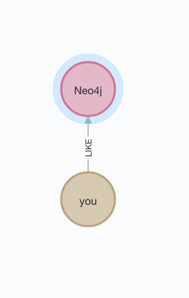
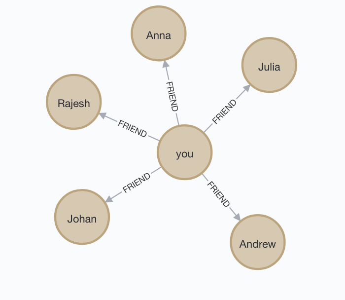

# Cypher Query

## 노드 생성하기

 - Person 인 Youngjin, Teamin 생성하기
    ```
    > CREATE (yyj:Person {name : 'Youngjin', age: 25})
    ```
    ```
    Output : Added 1 label, created 1 node, set 2 properties, completed after 16 ms.
    ```

- Graph Database 생성하기
    ```
    > CREATE (gdb:Book {title: 'Graph Databases',
                        authors: ['Ian Rabins', 'Jim Webber']})
    ```
    ```
    Output : Added 1 label, created 1 node, set 2 properties, completed after 20 ms.
    ```

## 기본 문법

 - Label에 소속된 node의 property를 리턴한다.
   - `MATCH (node:Label) RETURN node.property`
 - Label1에 소속된 node1과 Label2에 소속된 node2에 대해, 두 노드가 길이가 1인 관계가 있고(-->), node1의 propertyA가 {value}인 경우, node2의 propertyA와 propertyB를 리턴한다.
   - `MATCH (node1:Label1)-->(node2:Label2) WHERE node1.propertyA = {value} RETURN node2.propertyA, node2.propertyB`

 - (a)와 (b)가 길이 1의 관계가 있는 : `(a) --> (b)`
 - (a)와 (b)가 길이 1의 KNOWS 관계가 있는 : `(a)-[:KNOWS]->(b)`
 - (a)와 (b)가 길이 1의 KNOWS 관계가 있는, KNOWS 관계를 변수 rel에 할당. : `(a)-[rel:KNOWS]->(b)`
 - (a)와 (b)가 길이 1의 KNOWS 또는 LIKE 관계가 있는 : `(a)-[:KNOWS | :LIKE]->(b)`
 - (a)와 (b)가 길이 1의 관계가 since 속성이 2021이라면 : `(a)-[{since:2021}]->(b)`
 - (a)와 (b)가 길이에 상관없이 관계가 있는 : `(a)-[*]->(b)`
 - (a)와 (b)가 길이 2의 관계가 있는 : `(a)-[*2]->(b)`
 - (a)와 (b)가 길이 2 이상의 관계가 있는 : `(a)-[*2..]->(b)`
 - (a)와 (b)가 길이 2 이상 5 이하의 관계가 있는 : `(a)-[*2..5]->(b)`
 - (a)와 (b)가 길이 4 이하의 KNOWS 관계가 있는 : `(a)-[:KNOWS*..4]->(b)`

## 관계 형성하기

    - youngjin is a friend of teamin
        ```
        > CREATE (yyj)-[:FRIEND_OF{since:1357728400}]->(tm)
        ```
    - yyj와 tm은 HAS_READ gdb
        ```
        > CREATE (yyj)-[:HAS_READ{rating:4, on:1360396800}]->(gdb)
        > CREATE (tm)-[:HAS_READ{rating:5, on:1359878400}]->(gdb)
        ```
    - Youngjin과 teamin은 친구가 된게 언제부터인가.
        ```
        > MATCH (yyj)-[r:FRIEND_OF]-(tm)
        > RETURN r.since AS friend_since
        ```
        ```
        ╒═══════════════╕
        │"friends_since"│
        ╞═══════════════╡
        │1357728400     │
        └───────────────┘
        ```
    - Graph Databases의 평균 평점은 얼마인가.
        ```
        > MATCH (gdb)<-[r:HAS_READ]-()
        > RETURN avg(r.rating) AS average_rating
        ```
        ```
        ╒════════════════╕
        │"average_rating"│
        ╞════════════════╡
        │4.5             │
        └────────────────┘
        ```
    - youngjin과 teamin 중 나이가 많은 사람을 출력
        ```
        > MATCH (people:Person)
        > WHERE people.name = 'youngjin' OR people.name = 'teamin'
        > RETURN people.name AS oldest 
        > ORDER BY people.age DESC
        > LIMIT 1
        ```
        ```
        ╒════════╕
        │"oldest"│
        ╞════════╡
        │"teamin"│
        └────────┘
        ```
    - youngjin과 teamin중에 누가 먼저 책을 읽었는가.
        ```
        > MATCH (people:Person)
        > WHERE people.name = 'youngjin' OR people.name = 'teamin'
        > MATCH (people:Person)-[r:HAS_READ]->(gdb:Book {title : "Graph Databases"})
        > RETURN people.name AS first_reader
        > ORDER BY r.on 
        > LIMIT 1
        ```
        - 쿼리문 맞는거 같은데 왜 값이 안나올까...


## 쿼리 연습

### 모든 데이터 삭제 

```
> MATCH(n)
> DETACH DELETE n
```

### Person 추가 및 (person) - \[:LIKE\] -> (aThing)


Create Person
```
> CREATE (you:Person{name:'you'})
> RETURN you
```

(person) - \[:LIKE\] -> (aThing)
```
> MATCH (you:Person {name : 'you'})
> CREATE (you)-[like:LIKE]->(neo:Database{name:'Neo4j'})
> RETURN you,like,neo
```


### FRINDs 추가 / 질의
```
> MATCH (you:Person{name : 'you'})
> FOREACH(name in ['Johan', 'Rajesh', 'Anna', 'Julia', 'Andrew'] | CREATE (you)-[:FRIEND]->(:Person {name:name}))
```
```
> MATCH(you {name:'you'})-[:FRIEND]->(yourFriends:Person)
> RETURN you, yourFriends
```
Q. 왜 위 두개를 같이 쓰면 에러가 나는 거지...?
```
error 내용 : WITH is required between FOREACH and MATCH (line 3, column 1 (offset: 145)) "MATCH(you {name:'you'})-[:FRIEND]->(yourFriends:Person)"
```
